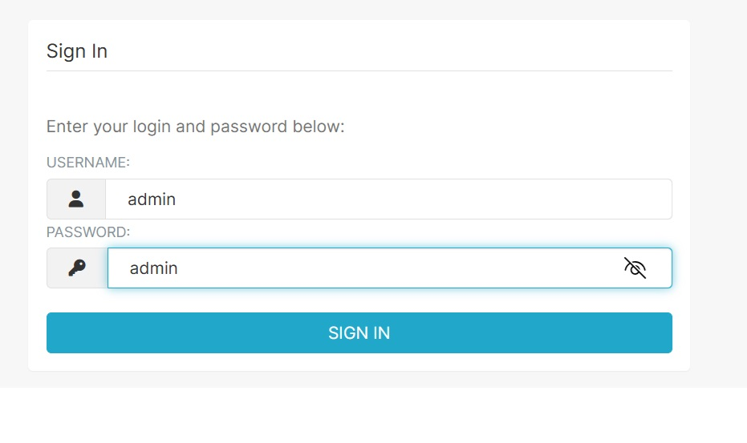
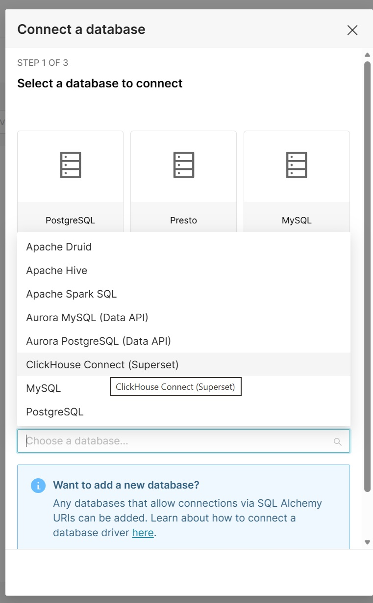
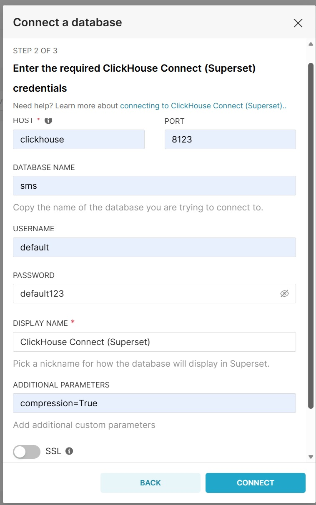

# SMS Analytics

Проект выполнен в рамках тестового задания на позицию **Data Engineer / Analytics Engineer**.

## 🎯 Цель

Построить воспроизводимый аналитический стек для анализа SMS-сообщений на базе **ClickHouse** и **Apache Superset**.

## 🚀 Что реализовано

- Развертывание ClickHouse, Generator и Apache Superset в docker-compose.
- Проектирование витрины `messages_mart`.
- Генерация 1 000 000 SMS за 1 год.
- Построение дашборда SMS Operations, DQ
- Скриншоты по дашбордам
- Обоснование выбора движка, партиционирования и ключа сортировки. (./clickouse/ddl/init.sql)
- Кастомизировае Superset через Feature flags
- Построение DQ дашборд для владельца данных

## 📊 SMS Operations Дашборд

- SMS по дням
- Delivery Rate
- Топ стран
- Топ операторов
- Выручка
- 
## 📊 DQ Дашборд

- Количество строк
- Количество уникальных идентификаторов SMS на стороне платформы / вендора
- Определение дублей идентификаторов SMS на стороне платформы / вендора
- Полнота данных
- Допустимость значений

## ▶️ Запуск

1. Запускаем команду docker compose up -d
2. После того, как сервесы поднимутся, перейдите по локльной ссылке http://localhost:8088/login/ к UI Superset
3. Необходимо ввести логин и пароль

4. Далее создаем новое подключение к базе данных, где в сплывающем окне выбираем ClikcHouse Connect (Superset)
   

6. Вводим необходимые реквизиты для подключения: host, port, user, password, database name
   

8. Переходим во кладку Dashboards и видим автоматически созданные дашборды

